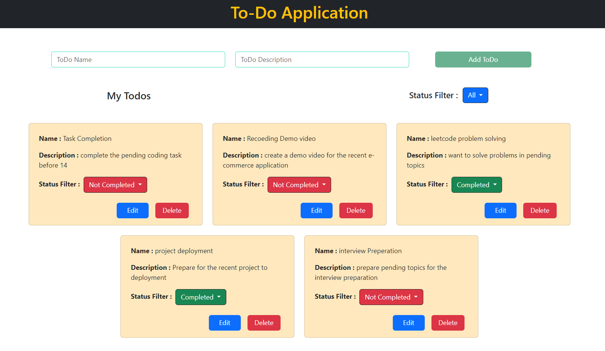
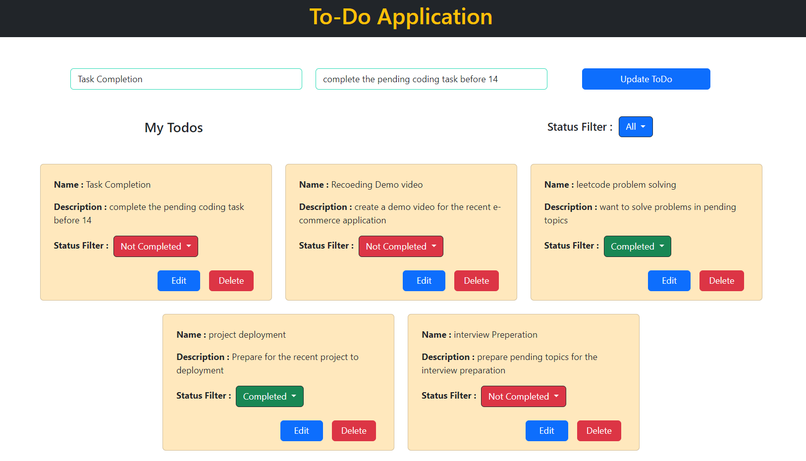

# React Todo Task

This is a Todo Application built with React.js that allows users to manage their tasks with CRUD (Create, Read, Update, Delete) functionalities. Users can create new tasks, edit existing ones, change task status, and filter tasks based on their status.





## Features

- Create Todo tasks with task name, description, and status.
- Default status is set to "Not Completed" for newly created todos.
- Edit and Delete buttons for updating and removing todos.
- Clicking on the status displays a dropdown to change the status to "Completed" or "Not Completed".
- Filter todos by status: Completed, Not Completed, and Both statuses.
- Todos are displayed in a Card layout.

## Technologies Used

- React.js
- HTML/CSS
- JavaScript

## Installation

1. Clone the repository:
   ```bash
   git clone https://github.com/your/repository.git
   cd repository-name
